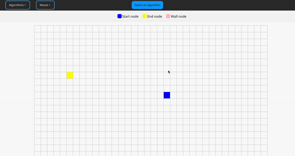

# Pathfinding visualizer

### How does it looks like

<a href="https://df-pathfinding.netlify.app/" target="_blank"></a>

###### Used algortihms

- [x] A\* Search
- [x] Dijkstra's Algorithm

###### TO DO

- [ ] Implement Greedy best-first Search algorithm
- [ ] Implement Breadth-first Search algorithm
- [ ] Implement Maze generation

#### Usage

```sh
  git clone https://github.com/dfoltynski/pathfinding-visualiser.git
  cd pathfinding-visualiser
  npm install
  npm start
```

or just visit https://df-pathfinding.netlify.app/
